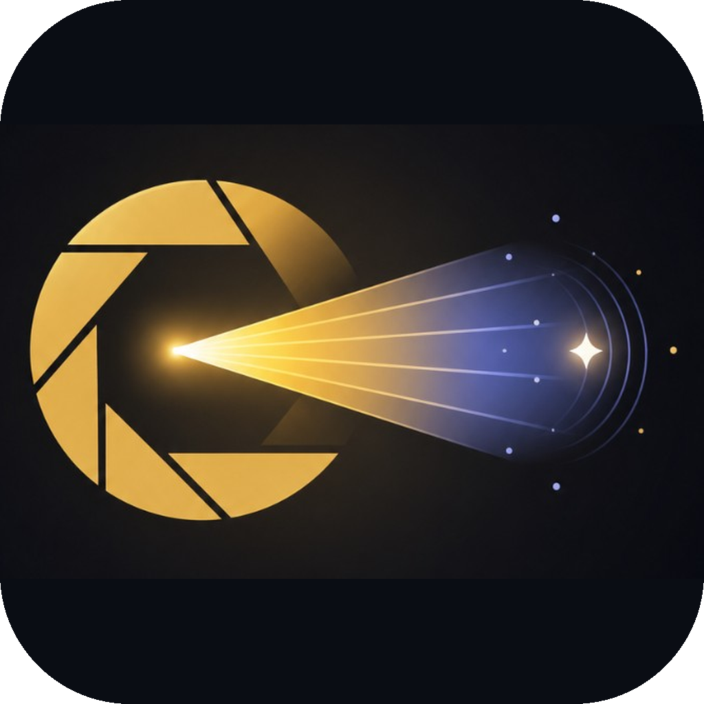
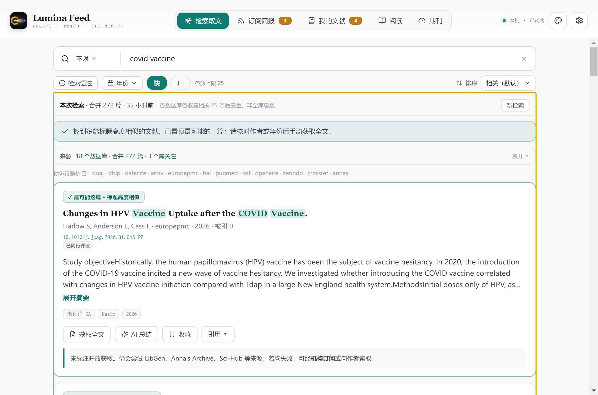
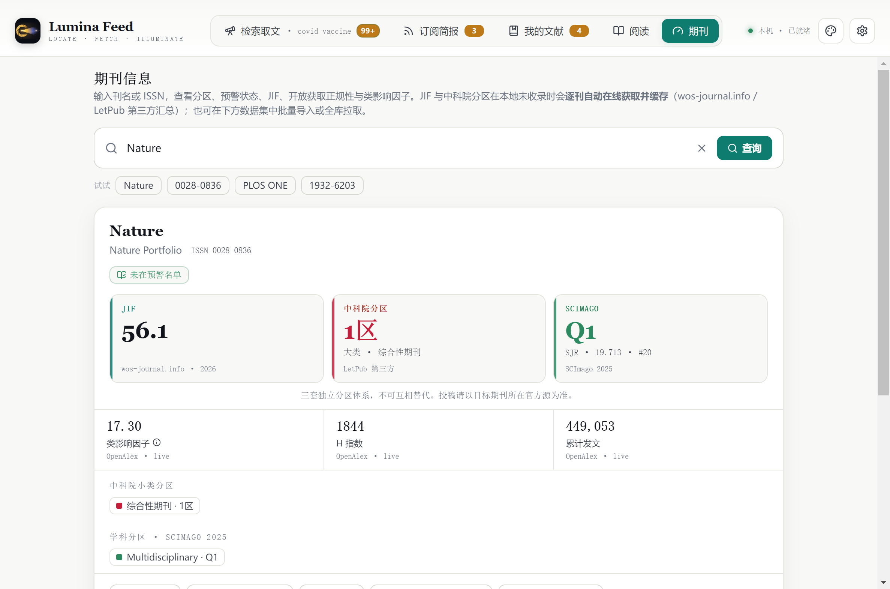
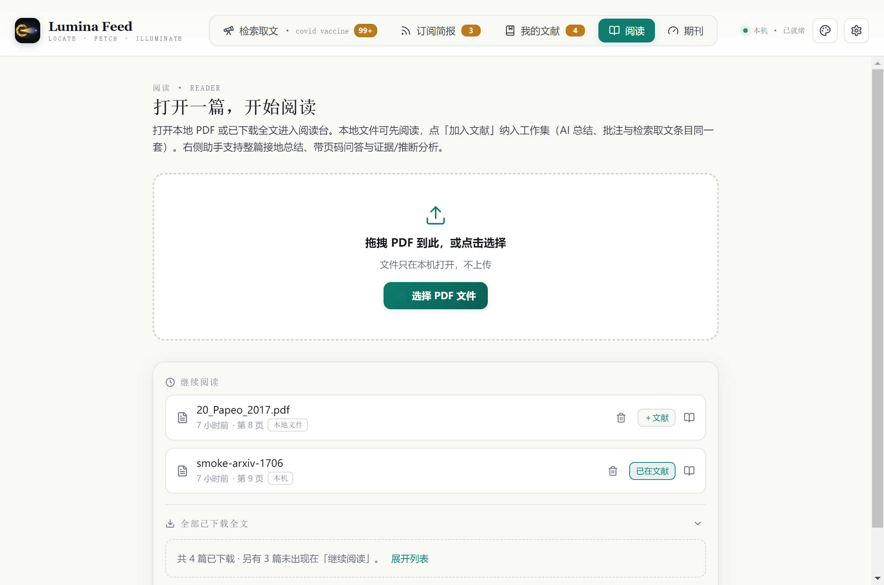
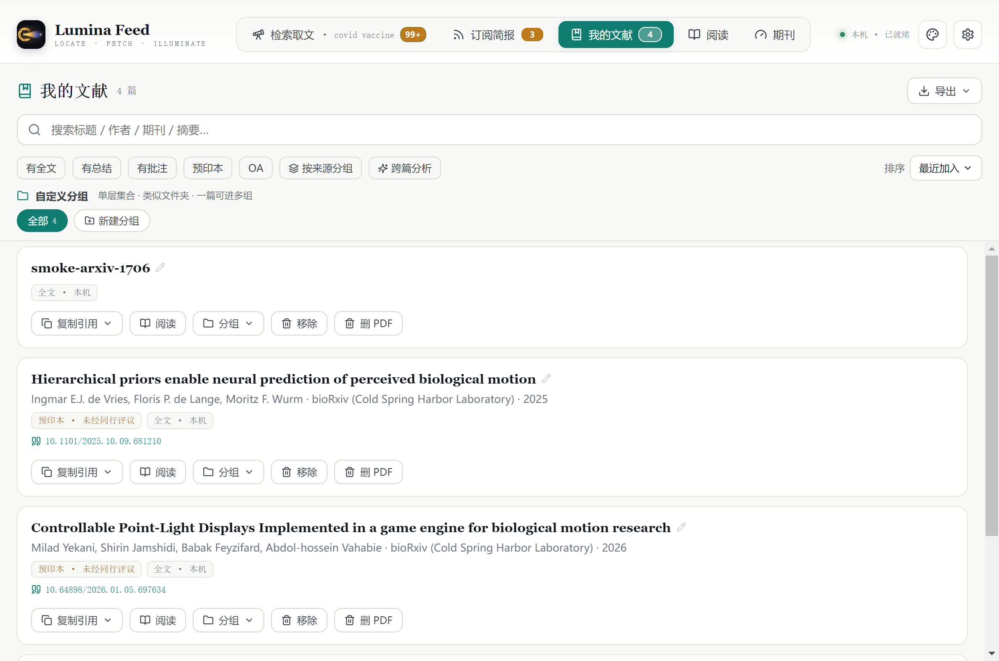
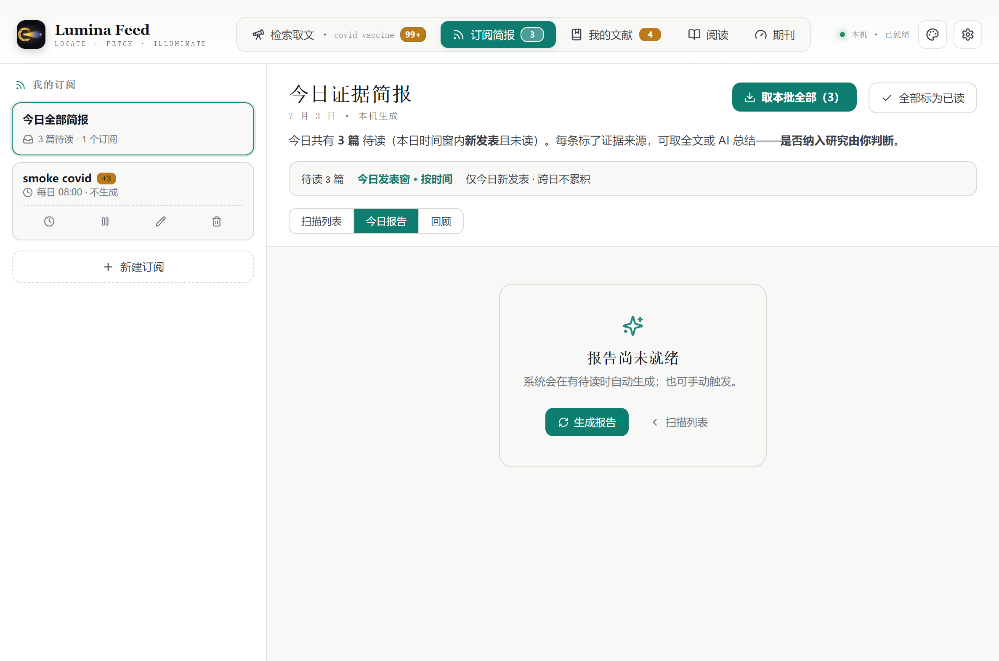

<div align="center">



# Lumina Feed

**面向科研人员的桌面级「文献检索 · 取文 · 接地阅读」一体化工具**

[](https://github.com/hisonWarren/Lumina-feed/releases/latest)
[](https://github.com/hisonWarren/Lumina-feed/releases/latest)
[](https://www.electronjs.org/)
[](#-合规与免责)

[⬇️ 下载最新版](https://github.com/hisonWarren/Lumina-feed/releases/latest) · [功能亮点](#-功能亮点) · [安装说明](#-安装)

</div>

---

## 预览

<p align="center">
  
  <br />
  <sub><b>检索取文</b> — 多源学术检索、合并去重、OA 解析链取全文 PDF</sub>
</p>

<table>
  <tr>
    <td width="50%" align="center">
      
      <br /><sub><b>期刊信息</b> — JIF · 中科院分区 · SCImago · 预警名单</sub>
    </td>
    <td width="50%" align="center">
      
      <br /><sub><b>内置阅读</b> — PDF 阅读、逐页翻译、接地问答（附页码）</sub>
    </td>
  </tr>
  <tr>
    <td width="50%" align="center">
      
      <br /><sub><b>我的文献</b> — 本地库、分组清单、去重管理</sub>
    </td>
    <td width="50%" align="center">
      
      <br /><sub><b>订阅简报</b> — 主题订阅、定期文献简报</sub>
    </td>
  </tr>
</table>

---

## ⬇️ 安装

前往 **[Releases](https://github.com/hisonWarren/Lumina-feed/releases/latest)**，按你的系统与 CPU 架构选择安装包：

| 平台 | 适用设备 | 文件名 |
|------|----------|--------|
| **Windows** | Intel / AMD 64 位 | `Lumina-Feed-*-windows-x64.exe` |
| **Windows** | ARM 笔记本（骁龙等） | `Lumina-Feed-*-windows-arm64.exe` |
| **macOS** | Apple 芯片（M 系列） | `Lumina-Feed-*-macos-arm64.dmg` |
| **macOS** | Intel Mac | `Lumina-Feed-*-macos-x64.dmg` |
| **Linux** | x86_64 | `Lumina-Feed-*-linux-x86_64.AppImage` |
| **Linux** | ARM64 | `Lumina-Feed-*-linux-arm64.AppImage` |

> 不提供 32 位 Windows 包。安装包由 GitHub Actions 在推送版本标签时自动构建。

<details>
<summary><b>各平台安装提示</b></summary>

- **Windows**：运行 `.exe`，按向导安装；首次打开若遇 SmartScreen 提示，选「更多信息 → 仍要运行」（未签名时的正常现象）。
- **macOS**：打开 `.dmg` 拖入「应用程序」；若提示无法验证开发者，在「系统设置 → 隐私与安全性」中允许。
- **Linux**：`chmod +x` 后双击或命令行运行 `.AppImage`。

</details>

---

## ✨ 功能亮点

| | 模块 | 你能做什么 |
|---|------|------------|
| 🔍 | **检索取文** | 多源检索（OpenAlex 等），合并去重，按 OA 解析链一键获取可校验 PDF |
| 📄 | **接地总结** | LLM 总结附原文页码引用，点击即可核对，减少幻觉 |
| 📖 | **内置阅读** | 缩略图同步、缩放、逐页翻译、全文接地问答 |
| 📬 | **订阅简报** | 按主题订阅，定期推送文献简报 |
| 📚 | **我的文献** | 本地收藏、清单分组、去重管理 |
| 📊 | **期刊信息** | JIF、中科院分区、SCImago、类影响因子、H 指数、预警名单 |

---

## 🛡️ 设计原则

- **可溯源** — AI 输出绑定原文页码，不臆造事实
- **来源透明** — 期刊指标分级标注（官方 / 第三方 / 实时查询）
- **本地优先** — 文献与 PDF 存于本机；API Key 走系统钥匙串

---

## 🛠️ 技术栈

`Electron` · `React` · `better-sqlite3` · `pdf.js` · `keytar`

<details>
<summary><b>从源码运行（开发者）</b></summary>

```bash
# Node.js ≥ 22.18
npm install
npx @electron/rebuild -f -w better-sqlite3,keytar
npm run start
```

AI 在应用内「设置 → 大模型」配置，支持 DeepSeek / OpenAI / Anthropic / Ollama 等。

</details>

---

## ⚖️ 合规与免责

1. 取文通过公开 OA 渠道实现，请在所在地法律与机构政策允许范围内使用。
2. 期刊分区、指标与预警状态仅供参考，投稿请以官方发布为准。

---

<div align="center">

**© 2026 [hisonWarren](https://github.com/hisonWarren)** · All rights reserved.

</div>
